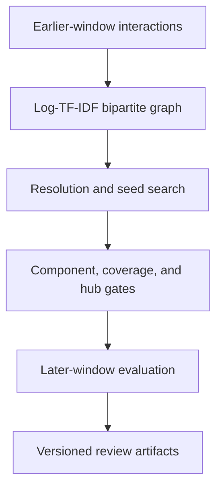

# Customer–Category Community Detection

[](https://github.com/parisaMSTFV/community-detection/actions/workflows/ci.yml)

[](DATA_PROVENANCE.md)

Which customer-category neighborhoods are structurally credible enough for analyst review? This
project builds a weighted bipartite graph, controls category-hub dominance, tests several Louvain
resolutions, and blocks weak partitions behind explicit graph and temporal guardrails.

| Decision question | Executed synthetic evidence | Interpretation |
|---|---:|---|
| Did the technical review floor pass? | `pass`; eligible-user coverage `100%` | Candidate for analyst review, not automatic activation |
| Is planted structure recoverable? | User ARI `0.825`; category ARI `1.000` | Implementation check on controlled data only |
| Is the result stable across seeds? | Minimum user ARI `0.929` | No tested seed produced a materially different user partition |
| Does it survive time and hub removal? | Temporal user ARI `0.724`; hub-removal ARI `0.989` | Passes the configured diagnostic floors |
| How well do later edges agree? | Overall `0.805`; unseen edges `0.213` | Strong on recurring edges, weak on discovery of new affinities |

These values describe 1,200 fictional users and 30 fictional categories. They do not establish
production validity, campaign adoption, incrementality, or business impact.


## Why this repository exists

Feature-based customer segmentation asks which customers look alike. This project asks a different
question: which users and product categories form densely connected behavioral neighborhoods?
A credible result can support audience and cross-category hypotheses, but a graph partition is not
evidence that targeting will improve an outcome. The workflow therefore stops at analyst review.

## Guarded workflow



The detection path never receives planted labels or outcomes. Synthetic truth is joined only after
the partition has been selected.

## Synthetic benchmark

The generator creates six fictional affinity families: Digital, Home, Style, Wellness, Family, and
Outdoor. Aggregate edge intensity is converted into two independent, non-overlapping windows:

- 90-day training window used for graph construction;
- 30-day later window used for edge agreement and partition drift;
- 6,572 observed user-category pairs across both windows;
- 97 later-window pairs that were not present in training;
- 52,626 total synthetic events.

This is a temporal simulation, not a random holdout from already-known edges. The 97 new pairs make
the weak unseen-edge result visible instead of allowing recurring behavior to dominate the claim.

## Methodology

### Identifier-safe bipartite graph

User and category namespaces are separated inside NetworkX, so a user and category may both have an
ID such as `001` without colliding. CSV identifiers are read as strings from the start, preserving
leading zeroes and Unicode text. Blank values, control characters, identifiers longer than 128
characters, and spreadsheet-formula prefixes are rejected.

### Hub-resistant edge weights

The default `log_tfidf` policy applies `log1p` to repeated interaction counts and downweights
categories reached by many users. Raw weights remain available for audit metrics. The reported hub
stress test removes the highest-weight category and recalculates the user partition.

### Resolution policy

Resolutions `0.8`, `1.0`, and `1.2` are compared without using planted labels. Selection combines:

- minimum user-level stability across five Louvain seeds;
- eligible-user coverage under minimum community sizes;
- weighted modularity;
- penalties for fragmented partitions.

The selected resolution is `1.2`. Full candidate results are in
[`reports/resolution_search.csv`](reports/resolution_search.csv).

### Guardrails

The quality gate checks:

- small connected-component node share at or below `25%`;
- at least `80%` of users in communities with five users and two categories;
- no category carrying more than `35%` of raw graph weight;
- user ARI of at least `0.70` after removing the largest category hub;
- train-to-future user ARI of at least `0.60` when a later snapshot is supplied.

Four disconnected user-category pairs can still produce high modularity and perfect seed stability,
but this gate marks that graph `review_required` because its components and communities are too
small. Passing these thresholds is a technical review floor, not a production guarantee.

### Snapshot continuity

Every assignment export contains a model version and source-derived snapshot ID. A later run can use
`--reference-assignments` to align numeric community labels by maximum typed-node overlap. The run
then writes `label_alignment.csv` and reports overlap and assignment-change rates.

## Executed results

| Evaluation | Result |
|---|---:|
| Quality gate | `pass` |
| Selected resolution | `1.2` |
| Detected communities | `6` |
| User ARI | `0.825` |
| Category ARI | `1.000` |
| Weighted modularity | `0.610` |
| Mean seed ARI | `0.972` |
| Minimum user seed ARI | `0.929` |
| Later-window agreement | `0.805` |
| Recurring-edge agreement | `0.812` |
| Unseen-edge agreement | `0.213` |
| Unseen-edge weight share | `1.06%` |
| Train-to-future user ARI | `0.724` |
| Hub-removal user ARI | `0.989` |
| Artifact fingerprint | `b9a714b7c50eeaa0` |


The category projection is a display artifact built from shared synthetic users. Detection runs on
the original bipartite graph, not on this category-only projection.

## Analyze an external edge list

The required CSV columns are:

| Column | Contract |
|---|---|
| `user_id` | Non-null, non-blank string; Unicode and leading zeroes are preserved |
| `category_id` | Non-null, non-blank string; typed separately from user IDs |
| `weight` | Finite, strictly positive number |

Each user-category pair must be unique. Aggregate repeated events before running the command.

External identifiers are pseudonymized by default with HMAC-SHA256. Supply a secret of at least 16
characters through an environment variable; the secret is never written to reports:

```bash
export COMMUNITY_DETECTION_ID_SALT="$(python -c 'import secrets; print(secrets.token_hex(32))')"
uv run community-detection analyze \
  --edges path/to/current_edges.csv \
  --output-root artifacts/current
```

For an approved public or fully synthetic file, raw identifiers require an explicit override:

```bash
uv run community-detection analyze \
  --edges examples/weighted_edges.csv \
  --output-root artifacts/example \
  --allow-raw-identifiers
```

Optional later-snapshot and label-continuity checks:

```bash
uv run community-detection analyze \
  --edges path/to/current_edges.csv \
  --future-edges path/to/later_edges.csv \
  --reference-assignments path/to/previous/community_assignments.csv \
  --output-root artifacts/current \
  --fail-on-review
```

Use the same secret across snapshots when aligning pseudonymized assignments. The input CSV is read
but never copied into the output directory. See the
[`edge-list contract`](docs/edge_list_contract.md) for the complete security and output contract.

## Reproduce the benchmark

Python 3.11 or 3.12 and [uv](https://docs.astral.sh/uv/) are required.

```bash
uv sync --locked --extra dev
make reproduce
make check
```

`uv.lock` fixes the full dependency graph. GitHub Actions repeats lint, formatting, the 90% coverage
gate, sensitive-content scanning, both CLI smoke paths, wheel construction, and an isolated
non-editable wheel run on Python 3.11 and 3.12.

## Audit outputs

```text
reports/
├── community_assignments.csv
├── community_profiles.csv
├── community_quality.csv
├── component_diagnostics.csv
├── model_manifest.json
├── resolution_search.csv
├── stability_pairs.csv
├── temporal_null_distribution.csv
├── metrics.json
├── run_summary.md
└── figures/
```

`model_manifest.json` records the model and schema versions, selected resolution, weighting policy,
dependency versions, source fingerprint, config fingerprint, identifier policy, and snapshot ID.

## Limitations

- The graph has planted family structure and is easier to interpret than real multi-intent behavior.
- Category ARI of `1.000` is specific to this fixture and should not be expected in production.
- The later window evaluates observed future interactions; it is not a calibrated link-prediction model.
- Unseen-edge agreement is only `0.213`, so this version should not be used to claim discovery of new affinities.
- Resolution selection is an unsupervised diagnostic policy and does not optimize a business outcome.
- Real deployments still need approved cohort definitions, late-arriving-data rules, retention periods, access controls, and outcome validation.
- No uplift test, campaign outcome, or business-value estimate is included.

## Portfolio distinction

This repository demonstrates graph modeling, guarded community detection, temporal validation, and
safe operational outputs. A feature-based customer segmentation project answers a different
question and should be judged with clustering quality, stability, and actionability metrics rather
than graph modularity.

## Author

Parisa Mostafavi · [LinkedIn](https://www.linkedin.com/in/parisa-mostafavi/)
