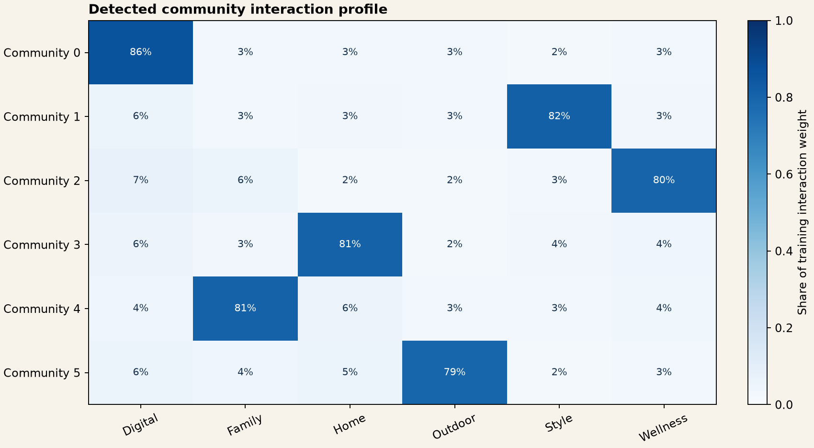
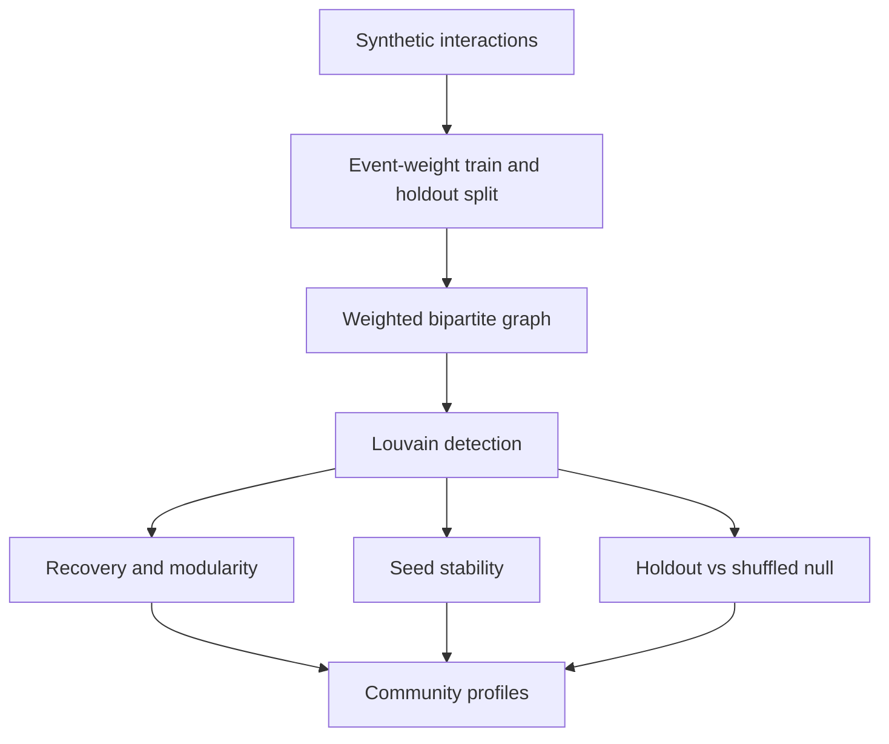
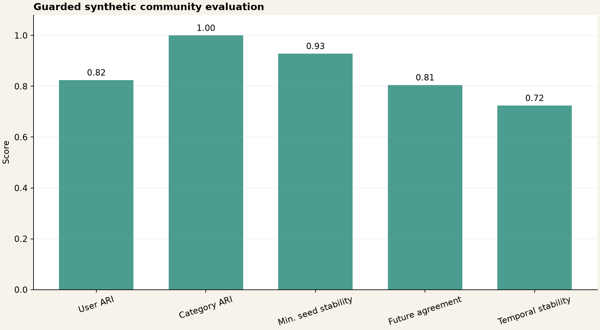
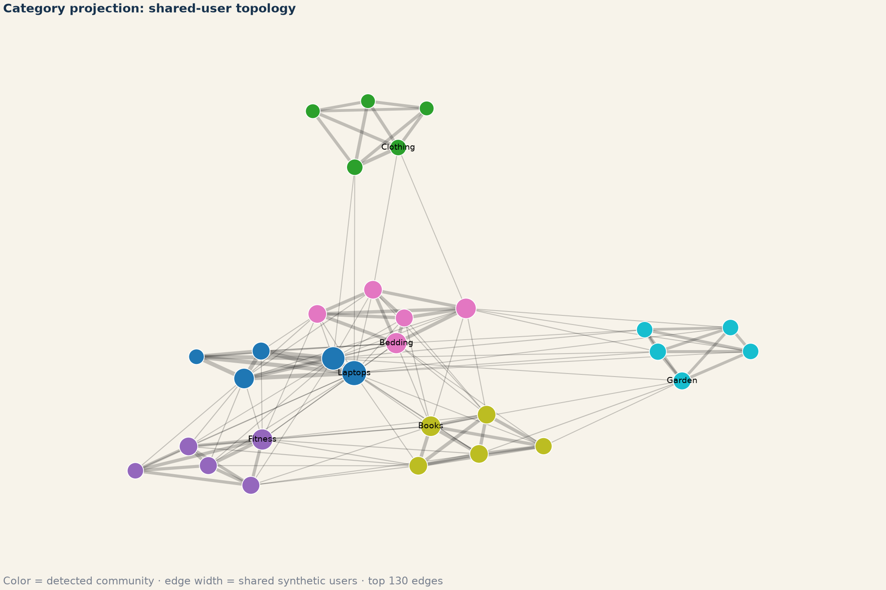
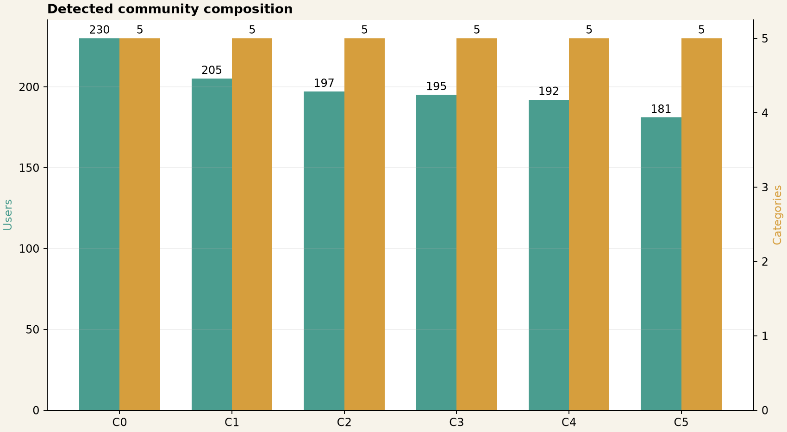

# Customer–Category Community Detection

[](https://github.com/parisaMSTFV/community-detection/actions/workflows/ci.yml)

[](DATA_PROVENANCE.md)

Which customer-category neighborhoods are strong enough to deserve analyst review? This project
turns a weighted bipartite edge list into Louvain communities, stability diagnostics, and readable
affinity profiles—without treating detected groups as proven campaign audiences.

| Decision question | Executed synthetic evidence | Appropriate use |
|---|---:|---|
| Is planted structure recoverable? | User ARI `0.902`; category ARI `1.000` | Validate this implementation on controlled data |
| Is the partition stable across seeds? | Mean ARI `0.978`; minimum `0.947` | Expose seed sensitivity before interpretation |
| Do known held-out edges remain coherent? | `0.826` vs `0.170` shuffled; `4.87×` lift | Prioritize communities for analyst review |

These metrics describe 1,200 synthetic users and 30 synthetic categories. They do not establish
performance on real behavior, adoption, campaign lift, or business impact.



## Quick start with a weighted edge list

```bash
python -m pip install -e ".[dev]"
community-detection analyze --edges examples/weighted_edges.csv --output-root artifacts/example
```

Inspect `artifacts/example/reports/community_assignments.csv`, `community_profiles.csv`, and
`metrics.json`. The input CSV is not copied, but its user and category IDs are written to the
assignment output; use only approved or public-safe identifiers.

## What the workflow does

Customer segmentation usually starts from a flat feature table. This project instead asks which
users and product categories form densely connected behavioral neighborhoods. Weighted Louvain
detection receives only graph edges; planted labels in the synthetic benchmark remain isolated in
a separate evaluation table.

## Business problem

Flat customer clusters can hide the topology linking customers to category interests. A mixed user-category community can support:

- audience discovery around category affinity rather than demographic assumptions;
- category-led campaign planning and cross-category exploration;
- identification of bridge categories that connect otherwise distinct interests;
- a network feature layer for downstream recommendation or experimentation.

The repository stops before activation. A detected community is a hypothesis about affinity, not proof that targeting it will create incremental value.

## Analytical questions

- Does weighted community detection recover the planted user and category structure without seeing evaluation labels?
- Is the partition stable when Louvain's random seed changes?
- Do held-out interaction events remain concentrated inside detected communities?
- Does that concentration exceed a topology-destroying shuffled-category baseline?
- Which category families and named categories characterize each detected group?

## Workflow



## Synthetic data

The generator creates:

- 1,200 fictional users with identifiers such as `USR-00001`;
- 30 fictional categories with identifiers such as `CAT-001`;
- six planted affinity families: Digital, Home, Style, Wellness, Family, and Outdoor;
- 6,696 unique user-category edges and 52,588 total interaction events;
- a 20% event-count holdout on each observed edge, while retaining at least one training event;
- ambiguous users with a strong secondary affinity to make recovery non-trivial.

The planted label is never included in the interaction table passed to graph construction. It is joined only after detection. See [data provenance](DATA_PROVENANCE.md).

## External edge-list contract

The separate `analyze` command accepts a CSV with three required columns:

| Column | Contract |
|---|---|
| `user_id` | Non-null, non-blank string |
| `category_id` | Non-null, non-blank string in a namespace disjoint from user IDs |
| `weight` | Finite, strictly positive number |

Each user-category pair must be unique; aggregate repeated events before running the command.
External mode reports assignments, community profiles, modularity, and seed stability. It does not
calculate ARI, holdout agreement, or business outcomes because those inputs are not supplied. See
the [full edge-list contract](docs/edge_list_contract.md).

## Methodology

### Weighted bipartite graph

User and category nodes form separate node types. An undirected edge represents observed interaction, and its training event count is the edge weight. No user-user or category-category edge is supplied to Louvain.

### Louvain community detection

NetworkX Louvain detection runs at resolution `1.0`. Detected numeric labels are relabeled by descending user count for readable artifacts. This relabeling does not affect ARI or modularity.

### Recovery metrics

Adjusted Rand index compares detected and planted partitions while remaining invariant to arbitrary numeric community labels. It is calculated separately for users, categories, and all nodes. Weighted modularity measures how much interaction weight is concentrated within the detected partition, but it is not treated as sufficient evidence on its own.

### Stability

Detection is repeated with seeds `11`, `23`, `37`, `53`, and `71`. Every pair of partitions is compared with ARI. Reporting both the mean and minimum prevents a high average from hiding one unstable run.

### Holdout and baseline

The holdout contains event weight removed from observed user-category edges before detection. The score is the share of held-out weight whose user and category receive the same detected community. It tests consistency on future events for known edges, not unseen-edge prediction.

For the null baseline, detected category labels are shuffled 100 times while user labels and community-size frequencies are retained. This breaks user-category topology without changing the category-label distribution.

## Executed results

| Evaluation | Result |
|---|---:|
| Detected communities | 6 |
| User ARI | 0.902 |
| Category ARI | 1.000 |
| Overall ARI | 0.904 |
| Weighted modularity | 0.650 |
| Mean pairwise seed ARI | 0.978 |
| Minimum pairwise seed ARI | 0.947 |
| Held-out interaction agreement | 0.826 |
| Shuffled-category null mean | 0.170 |
| Agreement lift | 4.87× |
| Core artifact fingerprint | `ef7a9d8885609374` |



High category recovery and lower user recovery are expected in this fixture: categories have one planted family, while one quarter of users receive a deliberately strong secondary affinity.

## Visual results

Each row is normalized by the training interaction weight of users assigned to that community. The dominant family supports interpretation, while the smaller off-diagonal shares show cross-community behavior.



This projection is a display artifact built from shared synthetic users. Detection itself runs on the original bipartite graph, not on this category-only projection.



`reports/community_profiles.csv` adds internal interaction share and the three leading category names for each community.

## Repository structure

```text
community-detection/
├── configs/analysis.json
├── data/
│   ├── README.md
│   ├── synthetic_interactions.csv
│   └── synthetic_ground_truth.csv
├── docs/interview_guide.md
├── examples/weighted_edges.csv
├── reports/
│   ├── figures/
│   ├── metrics.json
│   ├── community_assignments.csv
│   ├── community_profiles.csv
│   ├── stability_pairs.csv
│   └── holdout_null_distribution.csv
├── scripts/check_sensitive.py
├── src/community_detection/
├── tests/
└── .github/workflows/ci.yml
```

## Reproduce the synthetic benchmark

Python 3.11 or 3.12 is required.

```bash
python -m venv .venv
source .venv/bin/activate
python -m pip install -e ".[dev]"
make reproduce
make check
```

Windows PowerShell activation:

```powershell
.venv\Scripts\Activate.ps1
```

`community-detection smoke` runs the synthetic pipeline in a temporary directory without changing
checked-in artifacts. `make example` runs the external contract against the small example file and
writes ignored outputs to `artifacts/example/`.

## Tests and quality checks

The test suite checks deterministic generation, label isolation, event-weight reconciliation, input schema, bipartite edge types, node coverage, planted-label recovery, modularity, seed stability, holdout lift, normalized profiles, required outputs, and deterministic fingerprints.

GitHub Actions runs Ruff, format checks, Pytest on Python 3.11 and 3.12, the sensitive-content scan,
the full synthetic smoke pipeline, and the example external edge-list path. NetworkX is pinned to
`3.6.1` because seeded Louvain results and the committed fingerprint are implementation-sensitive.

## Limitations

- The graph has planted family structure and is easier to interpret than real multi-intent behavior.
- Category ARI of 1.000 is specific to this synthetic design and should not be expected in production.
- The event-count holdout tests known edges and is not a link-prediction evaluation.
- Louvain can have a resolution limit and may merge small but meaningful groups.
- Modularity can reward partitions that are statistically convenient but not actionable.
- The analysis uses one behavior type and one static period; it does not measure temporal drift.
- No uplift test, campaign outcome, or business-value estimate is included.

## Potential next steps

A production-oriented extension would compare behavior layers, use time-based snapshots, evaluate unseen-edge prediction, monitor partition drift, and test whether community-based targeting adds incremental value over existing audience rules. Any such extension would require an approved public-safe dataset and separate validation.

## Portfolio distinction

This repository demonstrates graph modeling and network validation. A customer segmentation project based on engineered customer features answers a different question and should be evaluated with clustering quality, stability, and actionability metrics rather than network modularity.

## Author

Parisa Mostafavi · [LinkedIn](https://www.linkedin.com/in/parisa-mostafavi/)
